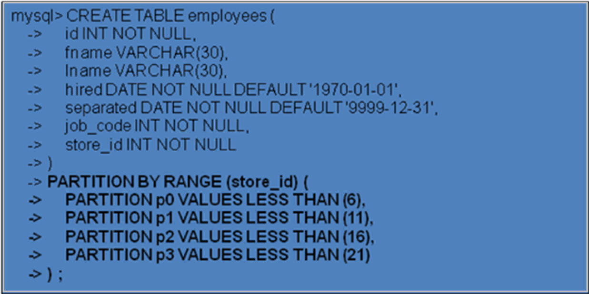
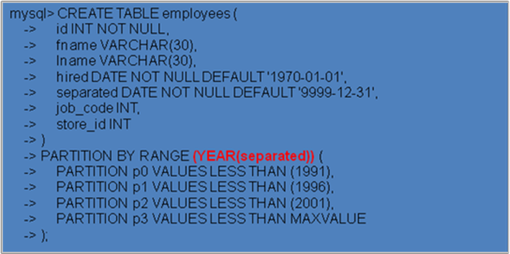
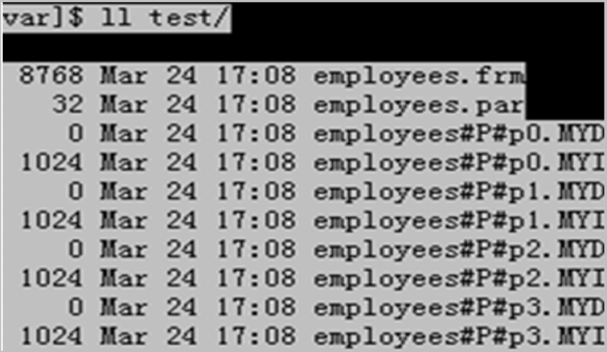
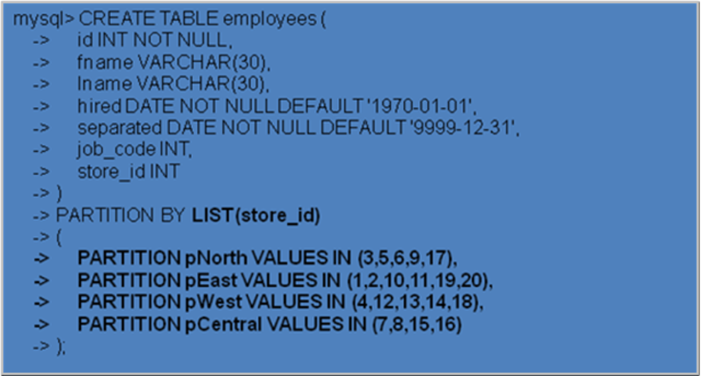
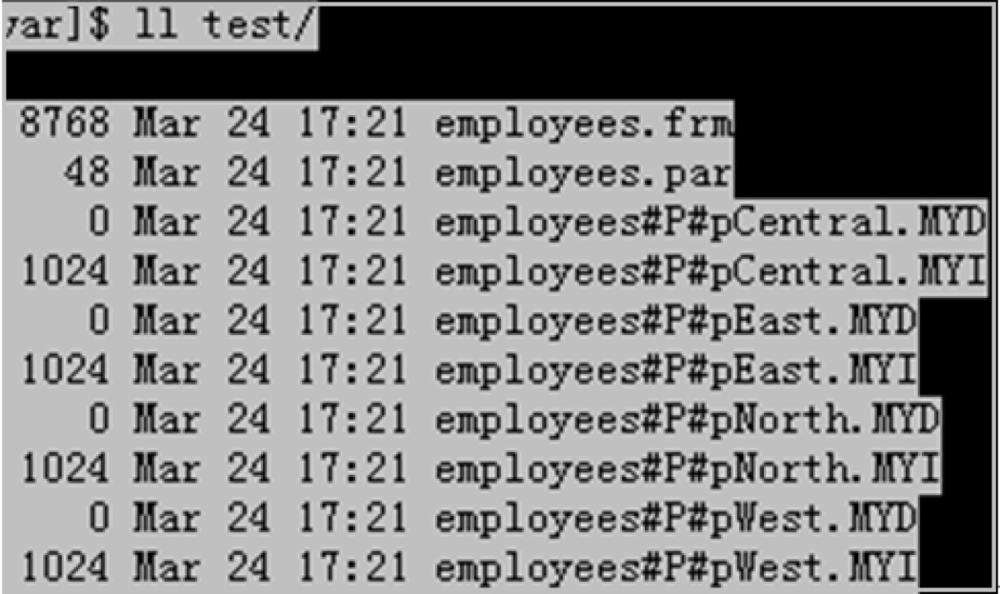
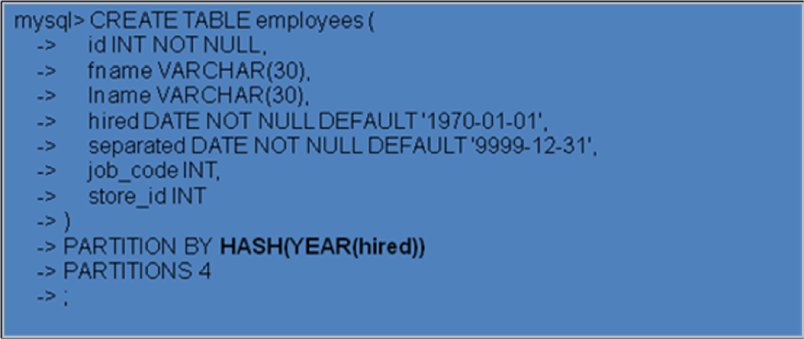

# 分区类型  

> 区别分表的特点就是:
>
> 分表是将一张表分成100张表   
>
> 分区是开发过程中还是当成一张表  但是物理形态 分成多个逻辑分区

MySQL的分区技术不同与之前的分表技术，它与水平分表有点类似，但是它是在逻辑层进行的水平分表，对与应用程序而言它还是一张表

​        range分区:基于属于一个给定连续区间的列值，把多行分配给分区

　　list分区:类似于按RANGE分区，区别在于LIST分区是基于列值匹配一个离散值集合中的某个值来进行选择

　　hash分区:基于用户定义的表达式的返回值来进行选择的分区，该表达式使用将要插入到表中的这些行的列值进行计算，这个函数可以包含MySQL中有效的、产生c非负整数值的任何表达式

​	  partition  by hash(id) partitions 5

　　key分区:类似于按HASH分区，区别在于KEY分区只支持计算一列或多列，且MySQL服务器提供其自身的哈希函数

例1：假定你创建了一个如下的表，该表保存有20家音像店的职员记录，这20家音像店的编号从1到20。如果你想将其分成4个小分区，那么你可以采用RANGE分区，创建的数据库表如下:



例2：假定你创建了一个如下的表，该表保存有20家音像店的职员记录，这20家音像店的编号从1到20。你想把不同时期离职的员工进行分别存储，那么你可以将日期字段separated（即离职时间）作为一个key，创建的SQL语句如下

		

这样你就可以对一个日期类型的字段调用mysql的日期函数YEAR()转换为一种整数类型，从而可以作为RANGE分区的key。这个时候你可以看到，分区后的物理文件是相对独立的

	

## LIST分区

LIST分区与RANGE分区有类似的地方，举个与例1类似的例子如下：

例3：假定你创建了一个如下的一个表，该表保存有20家音像店的职员记录，这20家音像店的编号从1到20。而这20个音像店，分布在4个有经销权的地区，如下表所示:	


那么你可以采用如下的LIST分区语句创建数据表:

 	

同样，它在物理文件上也会标识不同的分区

·

## HASH分区  要求必须是整型

HASH分区主要用来确保数据在预先确定数目的分区中平均分布。它可以基于用户定义的表达式的返回值来进行选择的分区，该表达式使用将要插入到表中的这些行的列值进行计算

例4：假定你创建了一个如下的一个表，该表保存有20家音像店的职员记录，这20家音像店的编号从1到20。你想把不同时期加入的员工进行分别存储，那么你可以将日期字段hired（即入职时间）作为一个key，创建的SQL语句如下:

··

## KEY分区

与HASH分区类似，但它的key可以不是整数类型，如字符串等类型的字段。MySQL 簇（Cluster）使用函数MD5()来实现KEY分区；对于使用其他存储引擎的表，服务器使用其自己内部的哈希函数，这些函数是基于与PASSWORD()一样的运算法则 


## 不同分区技术的对比

 	

## Mysql分区实例

```shell
创建分区表,按日期的年份拆分
mysql> CREATE TABLE part_tab ( c1 int default NULL, c2 varchar(30) default NULL, c3 date default NULL) engine=myisam 
PARTITION BY RANGE (year(c3)) (
PARTITION p0 VALUES LESS THAN (1995),
PARTITION p1 VALUES LESS THAN (1996) , PARTITION p2 VALUES LESS THAN (1997) ,
PARTITION p3 VALUES LESS THAN (1998) , PARTITION p4 VALUES LESS THAN (1999) ,
PARTITION p5 VALUES LESS THAN (2000) , PARTITION p6 VALUES LESS THAN (2001) ,
PARTITION p7 VALUES LESS THAN (2002) , PARTITION p8 VALUES LESS THAN (2003) ,
PARTITION p9 VALUES LESS THAN (2004) , PARTITION p10 VALUES LESS THAN (2010),
PARTITION p11 VALUES LESS THAN MAXVALUE ); 
注意最后一行，考虑到可能的最大值

```

### 未分区表

```
mysql> create table no_part_tab (c1 int(11) default NULL,c2 varchar(30) default NULL,c3 date default NULL) engine=myisam;			

```

```shell

通过存储过程灌入800万条测试数据
mysql> delimiter //   /* 设定语句终结符为 //，因存储过程语句用;结束 */ #set @i=0
mysql>
CREATE PROCEDURE load_part_tab()
       begin
    declare v int default 0;
    while v < 10000000
    do
        insert into part_tab
        values (v,'testing partitions',adddate('1995-01-01',(rand(v)*36520) mod 3652));
         set v = v + 1;
    end while;
    end// 
mysql> delimiter ;

```

## 执行load_part_tab存储

```
mysql> call load_part_tab();
Query OK, 1 row affected (8 min 17.75 sec)
mysql> insert into no_part_tab select * from part_tab; #数据复制   
Query OK, 8000000 rows affected (51.59 sec)
Records: 8000000 Duplicates: 0 Warnings: 0

```

## 测试SQL性能

```shell
mysql> select count(*) from part_tab where c3 > date '1995-01-01' and c3 < date '1995-12-31';      
+----------+
| count(*) |
+----------+
|   795181 |
+----------+
1 row in set (0.55 sec)
mysql> select count(*) from no_part_tab where c3 > date '1995-01-01' and c3 < date '1995-12-31'; 
+----------+
| count(*) |
+----------+
|   795181 |
+----------+
1 row in set (4.69 sec)
结果表明分区表比未分区表的执行时间少90% 
```

## explain 或者 desc 分析mysql代码

> 判断改sql语句效率怎么样 有没有索引失效等问题   

在 sql语句前面加上 explain 或者desc 

```shell
mysql> explain select count(*) from part_tab where c3 > date '1995-01-01' and c3 < date '1995-12-31'\G
*************************** 1. row ***************************
           id: 1
  select_type: SIMPLE  #查询类型 简单查询 联合查询  子查询
        table: part_tab # 显示这一行的数据是关于哪张表的 
   partitions: p1  # 分区 位于哪个分区下   
         type: ALL # 区间索引  全局搜索 						 ★ ★ ★如果是all 引起重视需要优化
possible_keys: NULL #可能使用到的索引                       	小重点
          key: NULL #实际使用的索引  primary 说明实用的是主键索引     重点  ★ ★ ★ ★ ★
      key_len: NULL #最长的索引宽度 
          ref: NULL # 哪个字段  或者  常数 一起 跟上面的key被使用 
         rows: 798458#mysql 遍历多少数据才能找到目标            ★ ★ ★ ★ ★这个是重点  
     filtered: 11.11 #过滤 百分比  
        Extra: Using where #执行状态的说明  还有种情况 用到了 Using index 
1 row in set, 1 warning (0.00 sec)

select * from users where id in(select uid from order_goods);
select_type:
	1.simple 简单的select 不使用联合查询 union 或者子查询  in  
	2.primary 最外边的select 
	3.union 第二个select或者后面的select 
	4.dependent union 第二个 select语句取决于 外面的select 
type:
	1.all 完全扫描 尽量避免完全扫描 
	2.distinct 一旦找到与查询的语句匹配的 就不再进行搜索了 
	4.using temporary #如果有这个 需要优化 因为这个需要创建一个临时来存放结果  这种情况下发生在 对不同的列进行 order by  不是group by  
	5.range 按照指定的区间扫描 
	6.index  索引  对表中的每个记录进行完全扫描    比all 要好的多  
```

```
mysql> explain select count(*) from part_tab where c3 > date '1995-01-01' and c3 < date '1995-12-31'\G 
*************************** 1. row ***************************
           id: 1
select_type: SIMPLE
        table: part_tab
         type: ALL
possible_keys: NULL
          key: NULL
      key_len: NULL
          ref: NULL
         rows: 798458
        Extra: Using where
1 row in set (0.00 sec)
explain语句显示了SQL查询要处理的记录数目

```

### 创建索引后  

```
mysql> create index idx_of_c3 on no_part_tab (c3);  #alter table no_part_tab add index idx_of_c3(c3);
Query OK, 8000000 rows affected (1 min 18.08 sec)  create index 不能创建主键索引
Records: 8000000 Duplicates: 0 Warnings: 0
mysql> create index idx_of_c3 on part_tab (c3);
Query OK, 8000000 rows affected (1 min 19.19 sec)
Records: 8000000 Duplicates: 0 Warnings: 0 

```

### 测试索引后效果

```
mysql> select count(*) from no_part_tab where c3 > date '1995-01-01' and c3 < date '1995-12-31'; 
+----------+
| count(*) |
+----------+
|   795181 |
+----------+
1 row in set (2.42 sec)   /* 为原来4.69 sec 的51%*/   
重启mysql ( net stop mysql, net start mysql)后，查询时间降为0.89 sec,几乎与分区表相同。
mysql> select count(*) from part_tab where c3 > date '1995-01-01' and c3 < date '1995-12-31'; 
+----------+
| count(*) |
+----------+
|   795181 |
+----------+
1 row in set (0.86 sec)
```

### 增加未索引字段查询

```shell
mysql> select count(*) from part_tab where c3 > date '1995-01-01' and c3 < date
'1996-12-31' and c2='hello';
+----------+
| count(*) |
+----------+
|        0 |
+----------+
1 row in set (0.75 sec)
mysql> select count(*) from no_part_tab where c3 > date '1995-01-01' and c3 < da
te '1996-12-31' and c2='hello';
+----------+
| count(*) |
+----------+
|        0 |
+----------+
1 row in set (11.52 sec)

```

 ```
\d //
create procedure p3()
begin
set @i=@i+1;
while @i<=10000 do
insert into t3 values(@i)；
set @i=@i+1;
end while;
end //
\d ;
show procedure status;

drop procedure p3;

call p3;


清空任何数据 


mysql> show status like '%slow%';
+---------------------+-------+
| Variable_name       | Value |
+---------------------+-------+
| Slow_launch_threads | 0     |
| Slow_queries        | 0     |
+---------------------+-------+
2 rows in set (0.00 sec)

 ```


## 如何获取有问题的sql语句 

> 开启慢查询   

```
1.修改配置文件   
ubuntu vim /etc/mysql/mysql.conf.d/mysqld.cnf   
centos vim /etc/my.cnf   


slow_query_log  = on		#开启慢查询
slow_query_log_file     = /var/log/mysql/mysql-slow.log  #慢查询的日志在哪 
long_query_time = 1					#超过多少秒 写入日志  
log_queries_not_using_indexes	    #没有使用到索引的也记录下来  


Ubuntu 重启  service mysql restart | stop | start 
centos 重启  service mysqld restart | stop | start 

```


## 在什么情况下使用到索引  

> 因为索引占据空间 索引并不是越k多越好 

* 纬度高的字段添加索引  
* where 、order_by、 group_by 常用的字段  
* 字段类型小的 
* 尽量使用组合索引  


### 什么情况下索引容易失效  

```
mysql> show status like "Handler_read%";
+-----------------------+----------+
| Variable_name         | Value    |
+-----------------------+----------+
| Handler_read_first    | 81       |
| Handler_read_key      | 2        |
| Handler_read_last     | 0        |
| Handler_read_next     | 2248989  |
| Handler_read_prev     | 0k        |
| Handler_read_rnd      | 0        |
| Handler_read_rnd_next | 35054109 |
+-----------------------+----------+
7 rows in set (0.00 sec)
 Handler_read_rnd_next | 35054109 这个值越大表示它的索引效率越低  
 结合慢查询 进行补救  


如果一个字段添加了索引 你还在上面参与运算 或者 使用函数 
select id,name from user where name like "%总段%";左边有% 索引铁定失效 
避免使用 or  尽量使用and 
最左原则:alter table user add index in_all(a,b,c,d); # 查询的时候必须加上a 否则select * from user where a>1 and 
索引失效 
username 这个字段是字符串类型 但是 你where的时候  写成了int 
select id,age from user where username=123;
```


## 两个比较使用的优化方法  

```
mysql> optimize table user; #收集碎片
+--------------+----------+----------+-------------------------------------------------------------------+
| Table        | Op       | Msg_type | Msg_text                                                          |
+--------------+----------+----------+-------------------------------------------------------------------+
| support.user | optimize | note     | Table does not support optimize, doing recreate + analyze instead |
| support.user | optimize | status   | OK                                                                |
+--------------+----------+----------+-------------------------------------------------------------------+
2 rows in set (0.02 sec)


mysql> check table part_tab; #检测表 
+------------------+-------+----------+--------------------------------------------------------------------------------------------------------------------------------------------------------+
| Table            | Op    | Msg_type | Msg_text                                                                                                                                               |
+------------------+-------+----------+--------------------------------------------------------------------------------------------------------------------------------------------------------+
| support.part_tab | check | status   | OK                                                                                                                                                     |
| support.part_tab | check | warning  | The partition engine, used by table 'support.part_tab', is deprecated and will be removed in a future release. Please use native partitioning instead. |
+------------------+-------+----------+--------------------------------------------------------------------------------------------------------------------------------------------------------+
2 rows in set (15.05 sec)

```


