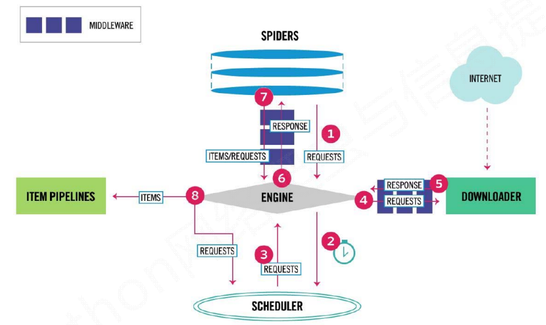
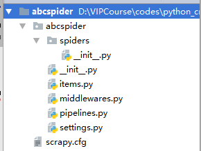

# Scrapy框架架构

## Scrapy框架介绍：

写一个爬虫，需要做很多的事情。比如：发送网络请求、数据解析、数据存储、反反爬虫机制（更换ip代理、设置请求头等）、异步请求等。这些工作如果每次都要自己从零开始写的话，比较浪费时间。因此`Scrapy`把一些基础的东西封装好了，在他上面写爬虫可以变的更加的高效（爬取效率和开发效率）。因此真正在公司里，一些上了量的爬虫，都是使用`Scrapy`框架来解决。

## Scrapy架构图：

1. 流程图（1）：
   
2. 流程图（2）：
   

## Scrapy框架模块功能：面试常问

1.爬虫发送请求 并不是马上发出去  而是发送给引擎 

2.再 发给调度器 调度器接收到url  以后 将url生成requests对象 存储到队列中

3.引擎从调度器种取出请求 

4.引擎将requests对象 扔给下载器   

5.下载器拿到请求从网上下载数据 再将数据 组装成response对象返回给引擎  

6.引擎拿到response对象 返回给爬虫  

7.爬虫对数据再进行分析  留下想要 的 数据 再返回给 引擎

 8.引擎再给管道   存到 redis 或者mysql 或者 mongodb中 excel

 引擎和下载器  之间 有中间件    爬虫和 引擎之间 也有中间件   

1. `Scrapy Engine（引擎）`：`Scrapy`框架的核心部分。负责在`Spider`和`ItemPipeline`、`Downloader`、`Scheduler`中间通信、传递数据等。类似于汽车发动机
2. `Spider（爬虫）`：发送需要爬取的链接给引擎，最后引擎把其他模块请求回来的数据再发送给爬虫，爬虫就去解析想要的数据。这个部分是我们开发者自己写的，因为要爬取哪些链接，页面中的哪些数据是我们需要的，都是由程序员自己决定。
3. `Scheduler（调度器）`：负责接收引擎发送过来的请求，并按照一定的方式进行排列和整理，负责调度请求的顺序等。
4. `Downloader（下载器）`：负责接收引擎传过来的下载请求，然后去网络上下载对应的数据再交还给引擎。
5. `Item Pipeline（管道）`：负责将`Spider（爬虫）`传递过来的数据进行保存。具体保存在哪里，应该看开发者自己的需求。
6. `Downloader Middlewares（下载中间件）`：可以扩展下载器和引擎之间通信功能的中间件。
7. `Spider Middlewares（Spider中间件）`：可以扩展引擎和爬虫之间通信功能的中间件。

# Scrapy快速入门

## 安装和文档：

1. 安装：通过`pip install scrapy`即可安装。
2. Scrapy官方文档：<http://doc.scrapy.org/en/latest>
3. Scrapy中文文档：<http://scrapy-chs.readthedocs.io/zh_CN/latest/index.html>

> 注意：
>
> 1. 在`ubuntu`上安装`scrapy`之前，需要先安装以下依赖：
>     `sudo apt-get install python3-dev build-essential python3-pip libxml2-dev libxslt1-dev zlib1g-dev libffi-dev libssl-dev`，然后再通过`pip install scrapy`安装。
> 2. 如果在`windows`系统下，提示这个错误`ModuleNotFoundError: No module named 'win32api'`，那么使用以下命令可以解决：`pip install pypiwin32`。
> 3. 下载 Twisted-18.9.0-cp36-cp36m-win_amd64.whl 然后放到指定的目录下 纯英文 没权限限制   切换到这个目录  pip install Twisted-18.9.0-cp36-cp36m-win_amd64.whl    
> 4. pip install scrapy  

## 快速入门：

### 创建项目：

要使用`Scrapy`框架创建项目，需要通过命令来创建。首先进入到你想把这个项目存放的目录。然后使用以下命令创建：

```
scrapy startproject [项目名称]
```

### 目录结构介绍：




   以下介绍下主要文件的作用：

      1. items.py：用来存放爬虫爬取下来数据的模型。
      2. middlewares.py：用来存放各种中间件的文件。
      3. pipelines.py：用来将`items`的模型存储到本地磁盘中。
      4. settings.py：本爬虫的一些配置信息（比如请求头、多久发送一次请求、ip代理池等）。
      5. scrapy.cfg：项目的配置文件。
      6. spiders包：以后所有的爬虫，都是存放到这个里面。


## 当引擎将下载组装的respons对象给 爬虫的时候   

爬虫对数据进行分析  

response.xpath() 详情 ctrl+鼠标点击 xpath 查看 其它的分析方法   返回的内容是 SelectorList 

一下两个都是将其转成Unicode编码  并提取出来

get() 返回的是Selector 中的第一个文本  

getall()返回的是Selector 中的所有文本 是个列表


   ### 使用Scrapy框架爬取糗事百科段子：

   #### 使用命令创建一个爬虫：

   ```
   scrapy genspider qsbk "qiushibaike.com"
   ```

   创建了一个名字叫做`qsbk`的爬虫，并且能爬取的网页只会限制在`qiushibaike.com`这个域名下。

   #### 爬虫代码解析：

   ```
   import scrapy
   
   class QsbkSpider(scrapy.Spider):
       name = 'qsbk'
       allowed_domains = ['qiushibaike.com']
       start_urls = ['http://qiushibaike.com/']
   
       def parse(self, response):
           pass
   ```

   其实这些代码我们完全可以自己手动去写，而不用命令。只不过是不用命令，自己写这些代码比较麻烦。
   要创建一个Spider，那么必须自定义一个类，继承自`scrapy.Spider`，然后在这个类中定义三个属性和一个方法。

   1. name：这个爬虫的名字，名字必须是唯一的。
   2. allow_domains：允许的域名。爬虫只会爬取这个域名下的网页，其他不是这个域名下的网页会被自动忽略。
   3. start_urls：爬虫从这个变量中的url开始。
   4. parse：引擎会把下载器下载回来的数据扔给爬虫解析，爬虫再把数据传给这个`parse`方法。这个是个固定的写法。这个方法的作用有两个，第一个是提取想要的数据。第二个是生成下一个请求的url。

   #### 修改`settings.py`代码：

   在做一个爬虫之前，一定要记得修改`setttings.py`中的设置。两个地方是强烈建议设置的。

   1. `ROBOTSTXT_OBEY`设置为False。默认是True。即遵守机器协议，那么在爬虫的时候，scrapy首先去找robots.txt文件，如果没有找到。则直接停止爬取。
   2. `DEFAULT_REQUEST_HEADERS`添加`User-Agent`。这个也是告诉服务器，我这个请求是一个正常的请求，不是一个爬虫。

   #### 完成的爬虫代码：

   1. 爬虫部分代码：

      ```
       import scrapy
       from abcspider.items import QsbkItem
      
       class QsbkSpider(scrapy.Spider):
           name = 'qsbk'
           allowed_domains = ['qiushibaike.com']
           start_urls = ['https://www.qiushibaike.com/text/']
      
           def parse(self, response):
               outerbox = response.xpath("//div[@id='content-left']/div")
               items = []
               for box in outerbox:
                   author = box.xpath(".//div[contains(@class,'author')]//h2/text()").extract_first().strip()
                   content = box.xpath(".//div[@class='content']/span/text()").extract_first().strip()
                   item = QsbkItem()
                   item["author"] = author
                   item["content"] = content
                   items.append(item)
               return items
      ```

   2. items.py部分代码：

      ```
       import scrapy
       class QsbkItem(scrapy.Item):
           author = scrapy.Field()
           content = scrapy.Field()
      ```

   3. pipeline部分代码：

      ```
       import json
      
       class AbcspiderPipeline(object):
           def __init__(self):
      
               self.items = []
      
           def process_item(self, item, spider):
               self.items.append(dict(item))
               print("="*40)
               return item
      
           def close_spider(self,spider):
               with open('qsbk.json','w',encoding='utf-8') as fp:
                   json.dump(self.items,fp,ensure_ascii=False)
      ```

   #### 运行scrapy项目：

   运行scrapy项目。需要在终端，进入项目所在的路径，然后`scrapy crawl [爬虫名字]`即可运行指定的爬虫。如果不想每次都在命令行中运行，那么可以把这个命令写在一个文件中。以后就在pycharm中执行运行这个文件就可以了。比如现在新创建一个文件叫做`start.py`，然后在这个文件中填入以下代码：

   ```
   from scrapy import cmdline
   
   cmdline.execute("scrapy crawl qsbk".split())
   ```


## pipline 管道 用来将数据存储在文件或者数据库中  有三个方法是常用的    

1. open_spider(self,spider) #当爬虫被打开的时候执行  

2. ```
   process_item(self, item, spider)当爬虫 有item 传递过来的时候 调用  
   ```

3.  close_spider(self,spider) #当爬虫关闭的时候调用


### scrapy 导出器  JsonItemExporter 、JsonLinesItemExporter

1.JsonItemExporter  

> 每次把数据添加到内存中 最后统一写到磁盘中   好处存储的是一个满足json规则的数据  缺点：数据量大  耗内存  

```
from  scrapy.exporters import JsonItemExporter,JsonLinesItemExporter
class QsbkPipeline(object):
    def __init__(self):
        self.fp = open("qsbk.json",'wb')
        self.exporter = JsonItemExporter(self.fp,ensure_ascii=False,encoding='utf-8')
        self.exporter.start_exporting()
    def open_spider(self,spider):
        print("爬虫开始了......")
    def process_item(self, item, spider):
        self.exporter.export_item(item)
        return item

    def close_spider(self,spider):
        self.fp.close()
        print("爬虫结束了......")
```

2.JsonLinesItemExporter

> 每次调用export_item 存到磁盘中 好处 不耗内存  直接持久化 安全  坏处  是每个字典是一行 整个文件不满足json规则   

```
from  scrapy.exporters import JsonLinesItemExporter
class QsbkPipeline(object):
    def __init__(self):
        self.fp = open("duanzi.json",'wb')
        self.exporter = JsonLinesItemExporter(self.fp,ensure_ascii=False,encoding='utf-8')
    def open_spider(self,spider):
        print("爬虫开始了......")
    def process_item(self, item, spider):
        self.exporter.export_item(item)
        return item

    def close_spider(self,spider):
        self.fp.close()
        print("爬虫结束了......")
```


### 糗事百科 分页  

```
 next_url = response.xpath("//ul[@class='pagination']/li[last()]/a/@href").get()
        if not next_url:
            return
        else:
            yield scrapy.Request(self.base_domain+next_url,callback=self.parse)
```


# CrawlSpider

在上一个糗事百科的爬虫案例中。我们是自己在解析完整个页面后获取下一页的url，然后重新发送一个请求。有时候我们想要这样做，只要满足某个条件的url，都给我进行爬取。那么这时候我们就可以通过`CrawlSpider`来帮我们完成了。`CrawlSpider`继承自`Spider`，只不过是在之前的基础之上增加了新的功能，可以定义爬取的url的规则，以后scrapy碰到满足条件的url都进行爬取，而不用手动的`yield Request`。

## CrawlSpider爬虫：

### 创建CrawlSpider爬虫：

之前创建爬虫的方式是通过`scrapy genspider [爬虫名字] [域名]`的方式创建的。如果想要创建`CrawlSpider`爬虫，那么应该通过以下命令创建：

```
scrapy genspider -t crawl [爬虫名字] [域名]
```

### LinkExtractors链接提取器：

使用`LinkExtractors`可以不用程序员自己提取想要的url，然后发送请求。这些工作都可以交给`LinkExtractors`，他会在所有爬的页面中找到满足规则的`url`，实现自动的爬取。以下对`LinkExtractors`类做一个简单的介绍：

```
class scrapy.linkextractors.LinkExtractor(
    allow = (),
    deny = (),
    allow_domains = (),
    deny_domains = (),
    deny_extensions = None,
    restrict_xpaths = (),
    tags = ('a','area'),
    attrs = ('href'),
    canonicalize = True,
    unique = True,
    process_value = None
)
```

主要参数讲解：

- allow：允许的url。所有满足这个正则表达式的url都会被提取。
- deny：禁止的url。所有满足这个正则表达式的url都不会被提取。
- allow_domains：允许的域名。只有在这个里面指定的域名的url才会被提取。
- deny_domains：禁止的域名。所有在这个里面指定的域名的url都不会被提取。
- restrict_xpaths：严格的xpath。和allow共同过滤链接。

### Rule规则类：

定义爬虫的规则类。以下对这个类做一个简单的介绍：

```
class scrapy.spiders.Rule(
    link_extractor, 
    callback = None, 
    cb_kwargs = None, 
    follow = None, 
    process_links = None, 
    process_request = None
)
```

主要参数讲解：

- link_extractor：一个`LinkExtractor`对象，用于定义爬取规则。
- callback：满足这个规则的url，应该要执行哪个回调函数。因为`CrawlSpider`使用了`parse`作为回调函数，因此不要覆盖`parse`作为回调函数自己的回调函数。
- follow：指定根据该规则从response中提取的链接是否需要跟进。
- process_links：从link_extractor中获取到链接后会传递给这个函数，用来过滤不需要爬取的链接。


# Scrapy Shell

我们想要在爬虫中使用xpath、beautifulsoup、正则表达式、css选择器等来提取想要的数据。但是因为`scrapy`是一个比较重的框架。每次运行起来都要等待一段时间。因此要去验证我们写的提取规则是否正确，是一个比较麻烦的事情。因此`Scrapy`提供了一个shell，用来方便的测试规则。当然也不仅仅局限于这一个功能。

## 打开Scrapy Shell：

打开cmd终端，进入到`Scrapy`项目所在的目录，然后进入到`scrapy`框架所在的虚拟环境中，输入命令`scrapy shell [链接]`。就会进入到scrapy的shell环境中。在这个环境中，你可以跟在爬虫的`parse`方法中一样使用了。


# Request和Response对象

## Request对象：

Request对象在我们写爬虫，爬取一页的数据需要重新发送一个请求的时候调用。这个类需要传递一些参数，其中比较常用的参数有：

1. `url`：这个request对象发送请求的url。
2. `callback`：在下载器下载完相应的数据后执行的回调函数。
3. `method`：请求的方法。默认为`GET`方法，可以设置为其他方法。
4. `headers`：请求头，对于一些固定的设置，放在`settings.py`中指定就可以了。对于那些非固定的，可以在发送请求的时候指定。
5. `meta`：比较常用。用于在不同的请求之间传递数据用的。
6. `encoding`：编码。默认的为`utf-8`，使用默认的就可以了。
7. `dont_filter`：表示不由调度器过滤。在执行多次重复的请求的时候用得比较多。
8. `errback`：在发生错误的时候执行的函数。

## Response对象：

Response对象一般是由`Scrapy`给你自动构建的。因此开发者不需要关心如何创建`Response`对象，而是如何使用他。`Response`对象有很多属性，可以用来提取数据的。主要有以下属性：

1. meta：从其他请求传过来的`meta`属性，可以用来保持多个请求之间的数据连接。
2. encoding：返回当前字符串编码和解码的格式。
3. text：将返回来的数据作为`unicode`字符串返回。
4. body：将返回来的数据作为`bytes`字符串返回。
5. xpath：xapth选择器。
6. css：css选择器。

## 发送POST请求：

有时候我们想要在请求数据的时候发送post请求，那么这时候需要使用`Request`的子类`FormRequest`来实现。如果想要在爬虫一开始的时候就发送`POST`请求，那么需要在爬虫类中重写`start_requests(self)`方法，并且不再调用`start_urls`里的url。