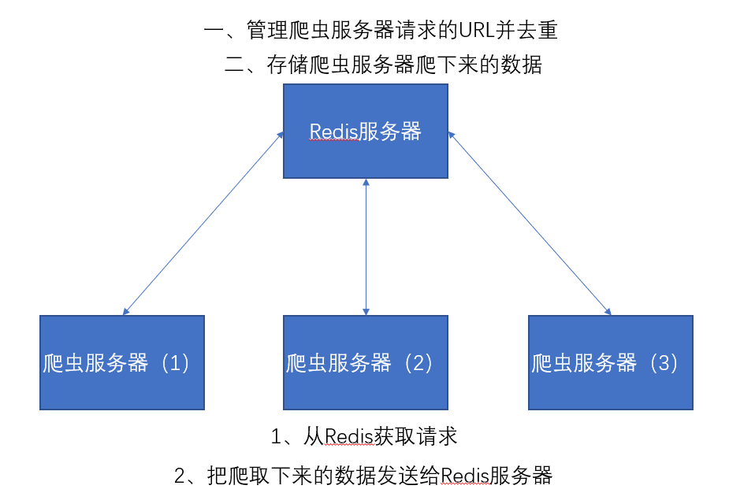

# Scrapy-Redis分布式爬虫组件

`Scrapy`是一个框架，他本身是不支持分布式的。如果我们想要做分布式的爬虫，就需要借助一个组件叫做`Scrapy-Redis`，这个组件正是利用了`Redis`可以分布式的功能，集成到`Scrapy`框架中，使得爬虫可以进行分布式。可以充分的利用资源（多个ip、更多带宽、同步爬取）来提高爬虫的爬行效率。

## 集群 

> 是一个物理形态 多台电脑放在这里 就是一个集群   

## 分布式 是一个工作方式  

> 多个节点共同完成某一个任务  
>
> 节点之间不通信 统一受  中央控制器调度  方便发现故障节点  及时剔除   还有后期能够方便扩容  


## 分布式爬虫的优点：

1. 可以充分利用多台机器的带宽。
2. 可以充分利用多台机器的ip地址。
3. 多台机器做，爬取效率更高。

## 分布式爬虫必须要解决的问题：

1. 分布式爬虫是好几台机器在同时运行，如何保证不同的机器爬取页面的时候不会出现重复爬取的问题。
2. 同样，分布式爬虫在不同的机器上运行，在把数据爬完后如何保证保存在同一个地方。

## 安装：

通过`pip install scrapy-redis`即可安装。

## Scrapy-Redis架构：

Scrapy架构图：


Scrapy-Redis架构图：


分布式爬虫架构图：


以上两个图片对比我们可以发现。`Item Pipeline`在接收到数据后发送给了`Redis`、`Scheduler`调度器调度数据也是从`Redis`中来的、并且其实数据去重也是在`Redis`中做的。

## 编写Scrapy-Redis分布式爬虫：

要将一个`Scrapy`项目变成一个`Scrapy-redis`项目只需修改以下三点就可以了：

1. 将爬虫的类从`scrapy.Spider`变成`scrapy_redis.spiders.RedisSpider`；或者是从`scrapy.CrawlSpider`变成`scrapy_redis.spiders.RedisCrawlSpider`。
2. 将爬虫中的`start_urls`删掉。增加一个`redis_key="xxx"`。这个`redis_key`是为了以后在`redis`中控制爬虫启动的。爬虫的第一个url，就是在redis中通过这个发送出去的。
3. 在配置文件中增加如下配置：

```
    # Scrapy-Redis相关配置
    # 确保request存储到redis中
    SCHEDULER = "scrapy_redis.scheduler.Scheduler"

    # 确保所有爬虫共享相同的去重指纹
    DUPEFILTER_CLASS = "scrapy_redis.dupefilter.RFPDupeFilter"

    # 设置redis为item pipeline
    ITEM_PIPELINES = {
        'scrapy_redis.pipelines.RedisPipeline': 300
    }

    # 在redis中保持scrapy-redis用到的队列，不会清理redis中的队列，从而可以实现暂停和恢复的功能。
    SCHEDULER_PERSIST = True

    # 设置连接redis信息
    REDIS_HOST = '127.0.0.1'
    REDIS_PORT = 6379
```

1. 运行爬虫：
   1. 在爬虫服务器上。进入爬虫文件所在的路径，然后输入命令：`scrapy runspider [爬虫名字]`。

      ```
      进入项目spiders所在的目录
      ```

      

   2. 在`Redis`服务器上，推入一个开始的url链接：`redis-cli> lpush [redis_key] start_url`开始爬取。